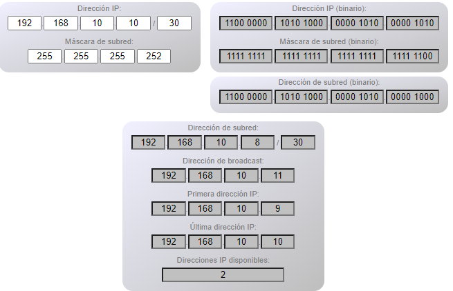
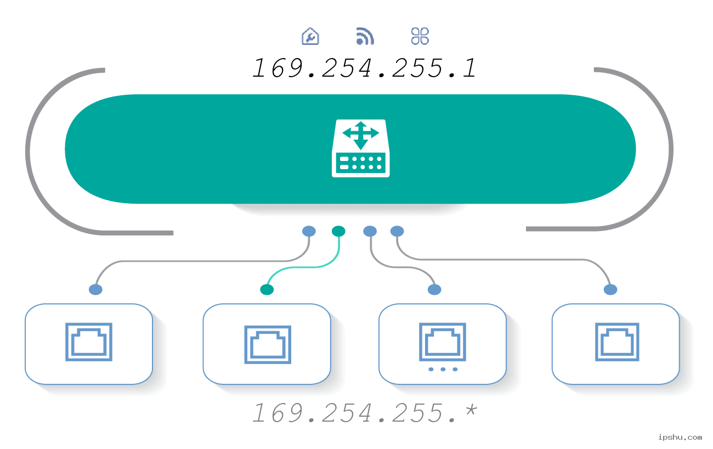
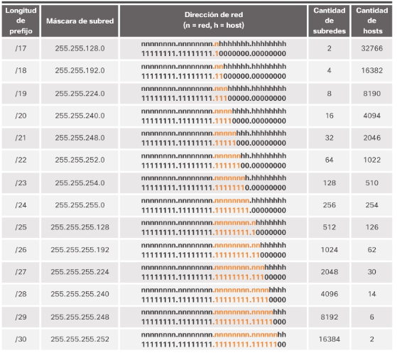
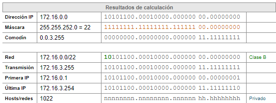

# Redes_G
Harvinson
# Preguntas reflexivas de ambientacion

¿Cuál es la dirección de red y de broadcast de un host que tiene una ip 192.168.10.10/30 .?

R/la direccion de red son:la Primera direccion: 192.168.10.9, segunda direccion y ultima: 192.168.10.10...
la direccion de broadcast: 192.168.10.11..

¿Que informacion se puede inferir de un host con la direccion 169.254.255.200/26?.

R/Podemos inferir que la direccion se encuentra en el cuarto rango donde encontramos las Direcciones PRIVADA estas direcciones son las que utilizamos con cables de ethernet, tambien son las que se utilizan para la autoconfiguracion de red o de enlace,
tener este cuarto rango privado es una medidad de emergencia para cuandon tenemos DHCP y nuestro hosts no tiene IP estatica asignada manualmente.

¿Cuantas subredes se pueden lograr con la mascara 172.16.0.0/22?.

R/La cantidad de subredes que podemos lograr con la mascara de la direccion IP de 172.16.0.0/22 son: 64 con una cantidad de hosts de 1022
.

¿Cuantos clientes pueden tener la red sub 172.16.0.0/22?.

R/La cantidad de cliente permitidos para conectarse a la red son 1022 ya que son la cantidad de host disponibles
